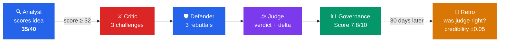

# Agent Constitution

**Governance harness for decision-making systems that need more than a raw answer.**
**Works for single-agent and multi-agent workflows. Adds structured review, epistemic honesty, and retrospective calibration.**

[](https://www.python.org/downloads/)
[](LICENSE)



Agent Constitution is a governance layer you can place around an existing assistant, planner, reviewer, or agent pipeline.

It is not only for multi-agent systems. You can use it to harden:

- a single assistant that needs challenge and review before acting
- a planner or deploy bot that should trigger governance only on high-stakes outputs
- a multi-agent workflow that needs explicit arbitration instead of free-form consensus

Agent Constitution helps these systems do three things that are often handled ad hoc:

- encode epistemic rules in markdown instead of inline prompt strings
- route high-stakes outputs through structured adversarial review
- track whether past judgments were actually right

What this looks like in a product surface:

```text
Before governance
Assistant:
  Recommendation: Deploy the billing-auth hotfix now.

After Agent Constitution summary gate
Assistant:
  Recommendation: Deploy the billing-auth hotfix now.
  Confidence: 82%

  Governance check triggered.
  Verdict: Proceed With Caution
  Score delta: -3
  Why: Several concerns remain unresolved before the next gate.
  Top concern: Rollback plan is still untested.
```

```
BEFORE                                    AFTER Agent Constitution
─────────────────────────────────────     ─────────────────────────────────────
Analyst: "Great opportunity!               Analyst: "Score: 35/40, confidence: 0.7"
         Score: 42/50"                     Score >= 32 → DEBATE TRIGGERED
Critic:  "I agree, looks promising."       Critic:  "Market size is [SPECULATION].
→ Ship it!                                          Competitor has 3x more runway."
→ 3 months later: competitor raised        Analyst: "Fair — revised to 28/50"
  $50M, market was 10x smaller             Judge:   "proceed_with_caution, delta: -7"
                                           30 days later: Retrospective confirms
                                             challenger was RIGHT. Credibility +0.05
```

> Other frameworks solve *how* components communicate.
> Agent Constitution focuses on *how decisions get challenged, judged, and audited*.

Short answers to the obvious questions:

- `Can I use this with a single agent?` Yes. A single assistant can still be wrapped with trigger rules, challenger/judge review, and audit history.
- `Do I need premium models everywhere?` No. Use stronger models where arbitration quality matters most, usually the critic and judge.
- `When does this add value over a single stronger model?` When the decision itself benefits from an explicit review process, not only a higher-quality answer.

---

## Quick Start

**One command. Zero config. No API key.**

```bash
pip install agent-constitution
ac debate "Should we build an AI code review tool?"
```

```
Agent Constitution  |  Adversarial Debate
Analyst: mock
Critic:  mock
Judge:   mock

1. Agents initialized
   analyst  | mock
   critic   | mock
   judge    | mock

2. Analyst evaluates: Should we build an AI code review tool?
   Score: 35/40
   Confidence: 75%

3. Score 35 >= 32 — debate triggered
   Challenges: 3 raised
   Defenses:   3 filed
   Verdict:    proceed_with_caution
   Delta:      -3
   Final:      35 -> 32

4. Audit trail (3 steps)
```

**Use real LLMs:**

```bash
# Anthropic API
export ANTHROPIC_API_KEY=sk-ant-...
ac debate "topic" --adapter anthropic

# Local models (free, private)
ollama serve
ac debate "topic" --adapter ollama --model llama3

# Claude CLI
ac debate "topic" --adapter claude --model sonnet

# Mixed-model debate from the CLI
ac debate "topic" --adapter claude --model sonnet --critic-model opus --judge-model opus
```

**What you get right away:**

- a zero-config debate demo with no API key
- strict schema validation for challenger, defender, and judge output
- a provisional governance score computed from recorded runs
- support for Mock, Anthropic, Ollama, and Claude CLI backends

## Model Strategy

Agent Constitution does **not** require Sonnet- or Opus-class models to function, but model quality has a direct effect on debate quality.

- For onboarding, CI, and structure checks, `MockAdapter` is enough
- For lightweight product demos or internal prototyping, a smaller real model can be acceptable
- For high-stakes review, use a stronger reasoning model for at least the critic and judge roles
- For launch, security, compliance, pricing, architecture, or memory-conflict decisions, Sonnet / Opus class models or their equivalent are strongly recommended

Current role-model behavior:

- CLI path: `ac debate ... --adapter ... --model ...` still gives you a fast shared default, but now also supports `--analyst-*`, `--critic-*`, and `--judge-*` overrides
- Library path: you can give each `BaseAgent(...)` its **own adapter and model**, so heterogeneous debate is also supported programmatically
- Product choice today: same-model debates remain the easy path; mixed-model debates are now a first-class advanced option

Example: heterogeneous role setup

```python
from adapters import AnthropicAPIAdapter
from constitution import BaseAgent, Constitution, Debate

rules = Constitution.default()

analyst = BaseAgent(
    role="analyst",
    goal="Produce the initial opportunity assessment",
    adapter=AnthropicAPIAdapter(model="claude-sonnet-4-5"),
    constitution=rules,
)
critic = BaseAgent(
    role="critic",
    goal="Pressure-test the assessment and surface hidden risks",
    adapter=AnthropicAPIAdapter(model="claude-opus-4-1"),
    constitution=rules,
)
judge = BaseAgent(
    role="judge",
    goal="Render the most reliable final verdict",
    adapter=AnthropicAPIAdapter(model="claude-opus-4-1"),
    constitution=rules,
)

debate = Debate(challenger=critic, defender=analyst, judge=judge)
```

Equivalent CLI pattern:

```bash
ac debate "Should we ship this pricing change?" \
  --adapter claude \
  --model sonnet \
  --critic-model opus \
  --judge-model opus
```

Three practical lenses:

- Developer: start with one shared model to simplify ops, then split judge / critic onto stronger models when accuracy matters more than cost
- Product manager: if the debate outcome changes user-visible recommendations, budget for a stronger judge before you budget for a fancier analyst
- Agent designer: the critic and judge usually benefit most from stronger reasoning; the analyst can often be cheaper if its output is challengeable and schema-validated

One caution: a stronger model does not replace good role design. If the personas, constitutions, and trigger policy are weak, using Opus everywhere mostly makes expensive bad process.

## How Debate Triggers

`ac debate "topic"` does **not** skip straight to the challenger/defender/judge round.
It runs in two stages:

1. the analyst produces an initial scored assessment
2. the debate engine checks whether that score crosses the trigger threshold

By default, structured debate triggers only when the initial analyst score is **32/40 or higher**.

- If score `>= 32`, the critic, defender, and judge run
- If score `< 32`, the CLI exits after the initial assessment and records that debate was not triggered

Quick ways to see it:

```bash
# Full CLI path: assessment first, then auto-trigger if threshold is met
ac debate "Should we build an AI code review tool?"

# Standalone mock demo with explicit topic input
python examples/demo_debate.py --topic "Should we build an AI code review tool?"
```

If you want to force a debate programmatically, call `Debate.run(...)` directly after your own scoring step. The library-level trigger check is `Debate.should_trigger(score)`.

## Integration Patterns

The most practical way to use Agent Constitution is usually as a **library gate inside an existing agent pipeline**, not only as a standalone CLI.

Common trigger patterns:

1. Score-gated library call

```python
result = my_agent.run("Should we deploy to production?")
score = extract_score(result)

debate = Debate(challenger=critic, defender=my_agent, judge=judge)
if debate.should_trigger(score):
    verdict = debate.run(topic=result, initial_score=score)
```

2. Hook-based governance gate

```python
from constitution import BaseAgent, Constitution, DecisionPolicy, GovernanceGateHook

policy = DecisionPolicy(
    action_types={"deploy", "launch", "migrate"},
    environments={"production"},
    critical_keywords={"auth", "billing", "security"},
    match_mode="any",
)

gate = GovernanceGateHook(
    challenger=critic,
    defender=defender,
    judge=judge,
    trigger_policy=policy,
    render_mode="summary",  # "silent" | "summary" | "full_transcript"
    response_formatter=GovernanceGateHook.chat_response_formatter("summary"),
)

agent = BaseAgent(
    role="planner",
    goal="Produce deployment recommendations",
    constitution=Constitution.default(),
    hooks=[gate],
)

response = agent.run("Should we deploy version 1.8.2 to production?")
if gate.last_result is not None:
    print(gate.last_result.verdict)
    print(gate.last_trigger_reasons)
```

3. External workflow trigger

Use your own rules to decide when a debate is mandatory, or let the built-in policy gate infer common high-stakes signals from planner output. This is the path that best fits external systems such as PM planners, deploy bots, PR reviewers, or memory pipelines that are not "Agent Constitution agents" themselves.

Auto-trigger opportunities usually show up around:

- production deploys
- auth / billing / security-sensitive PRs
- large architectural changes
- expensive or irreversible business decisions
- planner output with `action`, `environment`, or `decision_type` fields

If your upstream system is not debate-aware, pass a dedicated `defender=` agent into `GovernanceGateHook(...)` so the gate can challenge the decision without requiring the original planner to emit debate-shaped JSON.

User-facing render modes:

- `silent`: keep the original response unchanged, but still populate `gate.last_result`
- `summary`: append or inject a compact governance verdict for chat surfaces
- `full_transcript`: attach challenges, defenses, and audit trail for audit-heavy views

For chat products, pair `render_mode="summary"` with `GovernanceGateHook.chat_response_formatter("summary")` so the user sees a polished assistant reply instead of raw JSON enrichment.

If you want the most guided end-user experience, start with `python examples/demo_interactive.py --mock`, then try `python examples/demo_governance_gate.py`, `python examples/demo_user_experience.py`, and `python examples/demo_chat_surface.py` to see what users would actually see in each render mode and in a chat-style before/after view.

---

## Four Core Mechanisms

### 1. Constitutional Governance

Every agent injects epistemic rules at the system-prompt level.
Speculation must be tagged `[SPECULATION]`. Bad news gets promoted. Confidence is always 0.0-1.0.

Each agent has its own `SOUL.md`:

```markdown
# Analyst — Nate

## Mission
Evaluate opportunities with calibrated, multi-dimensional assessments.

## Hard Constraints
- Inherits all rules from ../../CONSTITUTION.md
- Must tag any market size estimate above $10B as [SPECULATION] unless sourced
- Always present the bear case before the bull case
```

Rules live in version-controlled markdown instead of inline strings. Edit a markdown file to change how an agent thinks.

### 2. Adversarial Debate

Controversial assessments (score >= 32/40) trigger structured debates.
A challenger raises three specific challenges. The defender rebuts each.
A judge renders a verdict with a score delta and full audit trail.

```python
from constitution import BaseAgent, Constitution, Debate

rules = Constitution.default()
analyst  = BaseAgent(role="analyst",  goal="Evaluate opportunities", constitution=rules)
critic   = BaseAgent(role="critic",   goal="Challenge assumptions",  constitution=rules)
judge    = BaseAgent(role="judge",    goal="Render fair verdicts",   constitution=rules)

debate = Debate(challenger=critic, defender=analyst, judge=judge)
result = debate.run(topic="Should we build an AI code review tool?")

result.verdict       # "proceed_with_caution"
result.score_delta   # -3
result.challenges    # ["Market is more competitive than assessed", ...]
result.audit_trail   # Full debate record
```

Every LLM response goes through **separate validation** before it's trusted.
The debate engine uses explicit schema validators (`_validate_challenges`, `_validate_defenses`, `_validate_verdict`) and rejects malformed debate output by default. If you want legacy fallback behavior, opt into `strict_validation=False`.

### 3. Retrospective Calibration

Periodic lookback verifies past predictions.
Did the risks materialize? Was the optimism justified?
Agents earn (or lose) credibility over time.

```python
from constitution import Retrospective

retro = Retrospective()
pred = retro.record_prediction("analyst", "Market will grow 3x", confidence=0.75)
# ... time passes ...
retro.verify(pred.id, outcome="correct")  # credibility +0.05
retro.get_credibility("analyst")          # 1.05
```

### 4. Lifecycle Hooks

Plug into any point in the governance pipeline without modifying core code.

```python
from constitution import BaseAgent, Debate, DebateHook, AgentHook

class AuditHook(DebateHook):
    """Log every debate step to an external system."""
    def post_verdict(self, result):
        send_to_datadog(result.audit_trail)
        return result

class CostApprovalHook(AgentHook):
    """Allow cost overruns instead of crashing."""
    def on_cost_limit(self, agent, cost_usd, total_cost):
        return "warn"  # "raise" (default) | "warn" | "allow"

# Built-in gate for existing agent pipelines
from constitution import DecisionPolicy, GovernanceGateHook

# Hooks compose — pass multiple, they chain in order
debate = Debate(challenger, defender, judge, hooks=[AuditHook()])
agent = BaseAgent(role="analyst", goal="Evaluate", hooks=[CostApprovalHook()])
policy = DecisionPolicy.high_stakes_default()
gate = GovernanceGateHook(
    challenger=critic,
    defender=defender,
    judge=judge,
    trigger_policy=policy,
    render_mode="summary",
)
```

Available hook points:

| Hook | When | Can modify |
|------|------|-----------|
| `AgentHook.pre_call` | Before LLM call | Prompt |
| `AgentHook.post_call` | After LLM call | Response content |
| `AgentHook.on_cost_limit` | Cost would exceed limit | Raise / warn / allow |
| `DebateHook.pre_challenge` | Before challenger runs | Topic |
| `DebateHook.post_challenge` | After challenge validation | Challenges list, revalidated before use |
| `DebateHook.pre_defense` | Before defender runs | Challenges |
| `DebateHook.post_defense` | After defense validation | Defenses list, revalidated before use |
| `DebateHook.pre_verdict` | Before judge runs | Abort (raise) |
| `DebateHook.post_verdict` | After verdict | Full result, revalidated before return |
| `DebateHook.on_validation_error` | Schema validation fails | Raise / fallback |

Hooks are best for logging, policy gates, and controlled transformations. In strict mode, any hook mutation that breaks the validated debate schema is rejected. `DecisionPolicy` lets a gate trigger from score, action type, environment, or critical keywords instead of relying on a single hard-coded score path.

---

## Governance Score

Measure how well-governed your agent system is from recorded CLI runs:

```bash
ac score
```

```
Dimension                  Score   Weight
─────────────────────────  ─────   ──────
Epistemic Honesty          8/10    25%
Constitutional Compliance  7/10    25%
Debate Rigor               6/10    20%
Calibration Accuracy       N/A     15%
Audit Completeness         9/10    15%

Provisional Governance Score: 6.3/10
```

The governance score tracks five dimensions: epistemic honesty, constitutional compliance, debate rigor, calibration accuracy, and audit completeness. `ac debate` records governance data to `workspace/governance_history.json`, and `ac score` aggregates those real runs instead of printing placeholders. Until you verify retrospectives, the report stays explicitly **uncalibrated** and should be treated as a provisional operational snapshot rather than a final grade.

---

## Why Agent Constitution?

### Why Now: The Governance Gap

2026 is the year of **agent governance**. Singapore launched the [world's first Agentic AI Governance Framework](https://www.imda.gov.sg/-/media/imda/files/about/emerging-tech-and-research/artificial-intelligence/mgf-for-agentic-ai.pdf) at WEF 2026. Gartner predicts 40% of enterprise apps will feature AI agents by year-end. There is growing attention on governance, but most public discussion still sits at the framework or policy layer.

Agent Constitution is one attempt to turn that discussion into installable code: explicit constitutional rules, policy-based triggering, structured adversarial review, and auditable outputs. It is not the only way to approach this problem, but it is a concrete starting point.

### Where It Sits in the Ecosystem

Agent Constitution is not a replacement for orchestration frameworks. It is a governance layer that can work alongside them.

| Dimension | CrewAI | LangGraph | AutoGen | Agent Constitution |
|-----------|--------|-----------|---------|----------------------|
| Agent coordination | Yes | Yes | Yes | Debate-scoped only |
| Adversarial debate | Not built-in | Not built-in | Via GroupChat | Structured + schema-validated |
| Retrospective calibration | Not built-in | Not built-in | Not built-in | Yes |
| Human-readable rules (SOUL.md) | Not built-in | Not built-in | Not built-in | Yes |
| Team governance | Not built-in | Not built-in | Limited | Core focus |
| Cost tracking | Via LiteLLM | Via callbacks | Via token tracking | Built-in + hooks |

These frameworks solve *how* agents coordinate. Agent Constitution focuses on a different question: *how decisions get challenged, judged, and audited*. They are complementary rather than competing.

---

## Personal Agent Mode

The same governance ideas can wrap a single personal agent too.

```python
from constitution import BaseAgent, Constitution
from adapters import OllamaAdapter

personal = BaseAgent(
    role="personal_assistant",
    goal="Help me think clearly",
    constitution=Constitution.from_soul_md("my_soul.md"),
    adapter=OllamaAdapter(model="llama3")  # Free, local
)
```

Same constitutional governance. Epistemic honesty, self-challenge, calibrated confidence.

```bash
python examples/demo_personal.py
```

---

## Supported LLM Backends

| Adapter | Requires | Use case |
|---------|----------|----------|
| `MockAdapter` | Nothing | Testing, demos, CI |
| `AnthropicAPIAdapter` | `ANTHROPIC_API_KEY` | Production with API billing |
| `ClaudeCLIAdapter` | Claude Max subscription | Local dev with Claude CLI |
| `OllamaAdapter` | [Ollama](https://ollama.com) running locally | **Free**, private, any open model |

Add your own:

```python
from adapters import LLMAdapter, LLMResponse

class MyAdapter(LLMAdapter):
    def call(self, messages, system_prompt="", tools=None, max_tokens=4096) -> LLMResponse:
        ...
```

---

## Core Modules

| Module | What it does |
|--------|-------------|
| `constitution/debate.py` | Adversarial debate engine + schema validators |
| `constitution/retrospective.py` | Prediction tracking + credibility calibration |
| `constitution/governance_score.py` | 5-dimension governance scoring from recorded runs |
| `constitution/cost_guard.py` | Token budget enforcement with hard limits |
| `constitution/base_agent.py` | BaseAgent with constitution injection |
| `constitution/hooks.py` | AgentHook + DebateHook lifecycle system |
| `constitution/cli.py` | `ac` CLI entry point (`ac debate`, `ac score`) |
| `adapters/mock.py` | Debate-aware mock adapter (zero API key) |
| `adapters/anthropic_api.py` | Anthropic API adapter |
| `adapters/ollama.py` | Ollama local models adapter |
| `adapters/claude_cli.py` | Claude CLI adapter |

## Tech Stack

| Tech | Role |
|------|------|
| Python 3.11+ | Runtime |
| [Rich](https://github.com/Textualize/rich) | CLI formatting and tables |
| PyYAML | Constitution / SOUL.md loading |
| httpx | HTTP client for Ollama and API adapters |
| pytest | 206 tests, zero API keys required |
| ruff | Linting and formatting |

---

## Architecture

```
CONSTITUTION.md              Shared epistemic rules (injected to all agents)
examples/agents/
  analyst/SOUL.md            Analyst identity, values, constraints
  critic/SOUL.md             Critic persona, debate role
  judge/SOUL.md              Judge impartiality rules

adapters/
  mock.py                    Debate-aware mock (zero API key)
  anthropic_api.py           Anthropic API
  claude_cli.py              Claude CLI
  ollama.py                  Ollama local models

constitution/
  base_agent.py              BaseAgent with constitution injection
  constitution.py            Constitution loader (SOUL.md / YAML / default)
  debate.py                  Adversarial debate engine + schema validators
  signal.py + signal_pool.py Signal dedup, cross-reference, filtering
  cost_guard.py              Token budget monitoring (pre-check, not post-record)
  trace.py                   RunTrace audit trail
  retrospective.py           Prediction recording + credibility calibration
  governance_score.py        Five-dimension governance scoring
  cli.py                     `ac` CLI
```

### Design Principles

- **Generator/Validator separation**: Every LLM response is generated, then validated by a separate function. The debate engine uses `_validate_challenges()`, `_validate_defenses()`, and `_validate_verdict()` and raises `DebateValidationError` on malformed debate output by default.
- **Constitution as prompt injection**: Rules live in markdown files, not Python strings. `SOUL.md` files are human-readable and version-controllable.
- **Cost guard with hard limit**: Budget limits are checked before recording each call's cost. When cumulative cost would exceed the hard limit, the guard raises `CostLimitExceeded` and halts further calls.

---

## Origin

Agent Constitution emerged from sustained experimentation with real decision workflows, review gates, and agent-mediated judgment loops.

It reflects a point of view shaped by implementation and repeated testing: for certain classes of decisions, improving model capability alone may not be enough. The decision itself can benefit from explicit challenge, arbitration, and auditability.

This repository does not present itself as a finalized standard for agent governance. It is a concrete, working proposal for how governance can be added to machine-made decisions without rebuilding an entire system from scratch.

We hope it serves both as a usable toolkit and as an invitation:

- to evaluate these ideas in real workflows
- to challenge the assumptions behind them
- to contribute stronger evidence, counterexamples, and better patterns

## Research Foundation

Multi-agent debate improves factual reasoning and reduces hallucination ([Du et al., 2023](https://arxiv.org/abs/2305.14325)). Heterogeneous agents with dynamic debate mechanisms outperform homogeneous approaches ([FREE-MAD, 2025](https://arxiv.org/abs/2509.11035)).

Agent Constitution draws on these findings and adapts them into a practical, installable governance workflow. The research is still evolving, and so is this project.

---

## Roadmap

These are exploratory directions, not shipped features.

**Current scope** — Governance harness
- Constitutional agent governance via `SOUL.md`
- Adversarial debate engine (challenger/defender/judge)
- Retrospective calibration with credibility tracking
- Personal agent mode
- 4 LLM backends: Mock, Anthropic, Claude CLI, Ollama
- `ac` CLI + Governance Score

**Near-term extensions**
- Per-turn token budgets (not just session-level hard limits)
- Permission gates on adapter calls (sub-agents get restricted scope)
- Auto-compaction with semantic retention for long-running sessions
- Consolidation engine: background learning extraction during idle time

**Longer-term experiments**
- Skill auto-creation from experience (with adversarial review before promotion)
- Dream/consolidation cycle: session end → extract learnings → update SOUL.md
- Memory MCP server (recall/store/consolidate across sessions)

- Model Context Protocol integration (tools as MCP servers)
- Cross-framework collaboration patterns
- Multi-platform gateway (Discord, Telegram, Slack)

> Why start with governance? Because protocols solve *how* agents communicate.
> Agent Constitution focuses on a complementary question: *how decisions get challenged, judged, and audited*.
> We believe this layer is worth getting right early.

---

## License

Apache-2.0 — see [LICENSE](LICENSE)

Use it freely. Modify it freely. Build on it commercially. Contributions are welcome under the project's [CLA](CLA.md).
